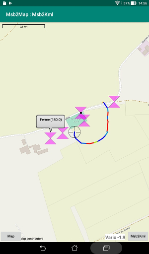
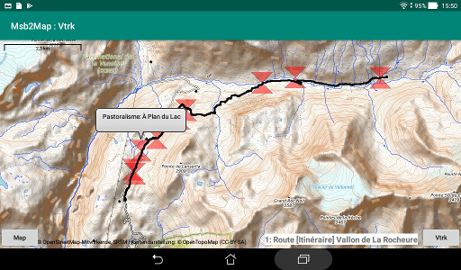

# Waypoints
The driving application could place waypoints as markers
at some locations. There are 5 possible forms for the markers:
red diabolo, small black dot, magenta diabolo, red butterfly
and black reticle.  
The butterfly and the reticle should be reserved for internal
use of Msb2Map.  
The diabolos and the butterfly are half transparent. They are
also complementary: they form a square when superposed.

A waypoint positioned by the user while in a picking session
has a form of butterfly.

Transient waypoints are drawn as a reticle.

# Lines
The suite of points of tracks and routes have no dedicated
representation: only the segments of lines that join them are drawn.
The color of each segment could be specified by the driving
application. The default color is black.

# Line drawing modes
There are two possible modes:

+ Entire track or route: the whole of the line is displayed at once.

+ Vapor trail: the driving application send the points with a
 delay between each one. The most recent location is noted as
 a reticle marker. Taping on this marker shows a bubble with
 the altitude (if available). The map is kept centered on this
 marker. Points and segments received before the last 20 locations
 are erased. This gives the impression of a vanishing vapor trail.  
 The driving application could change the orientation of the map
 for each new location.

