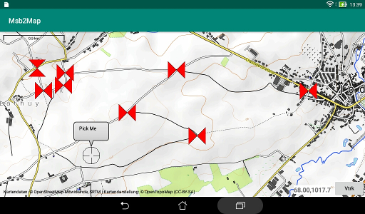
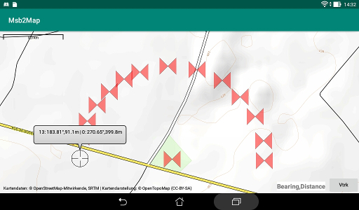

# Picking

A reticle marker with an indication "**Pick Me**" appears at the middle
of the lower left quadrant of the display as soon as the driving
application opens a picking session.  
This marker move with the map but if it hidden after zooming or panning,
it is re positioned in the lower left quadrant.  
It could be dragged to the location to be picked after a prolonged touch.
It jumps above the finger so that it is not hidden. The active location
remains the center of the marker.  
When it is released, its location is registered and it changes to a
butterfly marker. A new "Pick Me" marker appears as soon for
the next location to be specified.  
The location that is picked is transmitted to the driving application
that store it, waiting the conclusion of Msb2Map to inquire about
the disposition to be taken.

A picking session is opened specifically for isolated waypoints
of for successive points of a route.

# Re positioning

A previously selected location (butterfly marker) could be re positioned.
A long touch on the marker changes its form from a butterfly to a
reticle and it jumps above the finger. It can then be dragged to a
new location where it is processed as for an initial picking,
retaining its identity (same index) for the driving application.

# Waypoints

While a reticle marker for a waypoint is dragged, the marker is 
accompanied by a bubble showing the latitude and longitude 
of the location.

Once the final location is attained, a dialog appears to ask for
a name to be given to the waypoint and its altitude.
A default name based on the index of the waypoint is used
if no name is entered.  
The altitude could be evaluated from an interpolation based
on the constant altitude lines on the map. It could be ignored.

The waypoint is deleted if the "Forget" button of the dialog
is used.

# Route

While dragging the reticle marker for the first location of the route,
the information shown is the same as for an isolated waypoint.  
For each next point, the information shown is composed of
two parts (example: **13:188.81&deg;,91.1m|0:270.65&deg;,399.8m**).  
The first part (**13:188.81&deg;,91.1m**) is the bearing and the distance
from the previous point of the route. The second part
(**0:270.65&deg;,399.8m**) is the bearing and the distance from the **first**
point of the route.

No altitude is recorded as a name derived from the index is applied.
There is thus no dialog.

# Hint

Use a mouse for a better precision.
