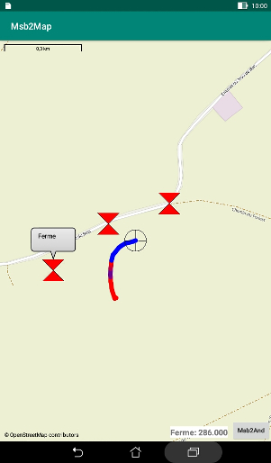

# Purpose
The Msb2Map Android application is designed to display on a map
the running position of a RC plane as computed by the
[Msb2And](https://github.com/msb2kml/Msb2And) application from
the Multiplex RC telemetry data.  
The minimum version of Msb2And is 1.2.

# Installation
The application should be compiled from the sources in this repository
or downloaded from the [Releases](https://github.com/msb2kml/Msb2Map/releases)
pages.

You need to have authorized the installation of applications from other sources than Google Play.

# Acknowledgments
This application make use of the library
[osmdroid](https://github.com/osmdroid/osmdroid).

The map is provided by the [OpenStreetMap](https://www.openstreetmap.org/)
Foundation.

# Standalone
This application is designed to be used in conjunction with the Msb2And
application; however it could be launched directly.  
It shows then all the locations stored in the file MSBlog/StartGPS.gpx :
see the explanations for [Msb2Kml](https://github.com/msb2kml/Msb2Kml/blob/RemoteGPS/Documents/RemoteGPS.md) and for
[Msb2And](https://github.com/msb2kml/Msb2And/blob/master/Documents/RemoteGPS.md).  
The locations are displayed as markers with a form of diabolo.  
Taping on a marker shows a bubble with the name of the location.  
Taping on a bubble hide it.

Locations as turn points could be defined in the file StrartGPS.gpx
with the help of the [Msb2Kml](https://github.com/msb2kml/Msb2Kml/)
application.

A button in the right lower corner let you close this application
and maybe return to the Msb2And application. 
An information field on the side of this button show the number
of locations found in the StartGPS.gpx file.

The zoom level and the orientation of the map are adjustable with
a two fingers gesture. 
The map may be moved by dragging with a finger.

# Launched by Msb2And
When launched through Msb2And, a continuous flow of data is received.  
The current location of the plane is noted as a marker with a form
of reticule and the map is kept centered on this marker.  
The information field show the value of the parameter that has
been associated by Msb2And.
 
A tail (or "ribbon") is drawn behind the current location. It covers
20 previous locations and its default color is black.  
The application "**Msb2And**" could give a colour to each segment
from the value of the parameter named "**%**" computed with
the function "**=COL**".

# Getting the map
The tiles composing the map are downloaded from the server of the
"**Open Street Map Foundation**" and are kept in a local cache while they
are valid. 
Access to the Internet is thus needed at some time.  
But if one has had a look at the region of interest with the appropriate
zoom level, all the needed tiles are in the cache and no further
Internet access is needed.

The cache is common to most applications using the "**osmdroid**" library
like the demo application available from [F-Droid](https://f-droid.org/packages/org.osmdroid/)
or from [Google Play](https://play.google.com/store/apps/details?id=org.osmdroid).

# Permissions and Android version
This application should work on Android versions from
Jelly Bean (4.1) to Oreo (8.0).  
It need access to the Internet and to the storage.  
Access to the location service (GPS) is not needed.

# Screenshot

