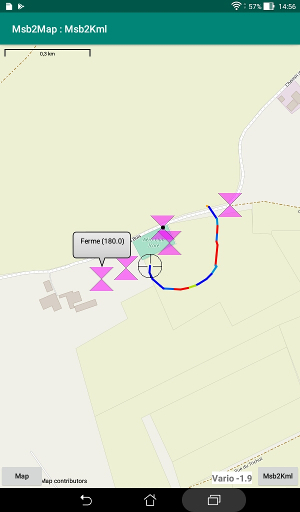

# Purpose
The Msb2Map Android application is designed to be the map display
component for some other application like
[Msb2And](https://github.com/msb2kml/Msb2And),
[Msb2Kml](https://github.com/msb2kml/Msb2Kml) or
[Vtrk](https://github.com/msb2kml/Vtrk).

The driving application could display locations and lines
for tracks and routes. It could also start a picking session letting
the user select locations to be processed as waypoints or a route.

The map could be zoomed, panned and rotated with the fingers.  
It could also be rotated by the driving application (like keeping a heading).

It is retrieved through the Internet from the data compiled by
the [OpenStreetMap](https://www.openstreetmap.org/)
Foundation.  
The last displayed maps tiles are cached so a permanent network
access is not needed.

Look for the files in the **Documents** directory for more
details about the usage.

# Installation
The application should be compiled from the sources in this repository
or downloaded from the [Releases](https://github.com/msb2kml/Msb2Map/releases)
pages.

You need to have authorized the installation of applications from
other sources than Google Play.

# Acknowledgments
This application make use of the library
[osmdroid](https://github.com/osmdroid/osmdroid).

The map is provided by the [OpenStreetMap](https://www.openstreetmap.org/)
Foundation.

# Permission and Android version
This application should work on Android versions from
Jelly Bean (4.1) to Oreo (8.0).  
It need access to the Internet.  
Access to the location service (GPS) is not needed.

# Screenshots
Track in vapor trail mode and waypoints.

Route and waypoints.

