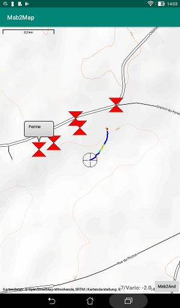

# Purpose
The Msb2Map Android application is designed to display
some GPS track, route and waypoint on a map background.
It is typically launched and driven
by another application like [Msb2And](https://github.com/msb2kml/Msb2And),
[Msb2Kml](https://github.com/msb2kml/Msb2Kml) or
[Vtrk](https://github.com/msb2kml/Vtrk).

# Installation
The application should be compiled from the sources in this repository
or downloaded from the [Releases](https://github.com/msb2kml/Msb2Map/releases)
pages.

You need to have authorized the installation of applications from
other sources than Google Play.

# Acknowledgments
This application make use of the library
[osmdroid](https://github.com/osmdroid/osmdroid).

The map is provided by the [OpenStreetMap](https://www.openstreetmap.org/)
Foundation.

# Getting the map
The tiles composing the map are downloaded from the server of the
"**Open Street Map Foundation**" and are kept in a local cache while they
are valid. 
Access to the Internet is thus needed at some time.  
But if one has had a look at the region of interest with the appropriate
zoom level, all the needed tiles are in the cache and no further
Internet access is needed.

The cache is common to most applications using the "**osmdroid**" library
like the demo application available from
[F-Droid](https://f-droid.org/packages/org.osmdroid/) or from
[Google Play](https://play.google.com/store/apps/details?id=org.osmdroid).

# Locations
The application could display some locations as markers with a
form of diabolo. 
Taping on a marker shows a bubble with the name of the location. 
Taping on a bubble hide it.

# StartGPS.gpx
This file contains the locations that could be specified as
starting points of flights for Msb2Kml and Msb2And. It could also
contain other locations like turning points. 
The content of this file is displayed by default.  
An option could be selected to not display this file: then there is no need
for the permission to read the file system.

# Map control
The map could be moved, rotated and zoomed with movements of the fingers. 
There is on the bottom right of the screen a button than terminate
the application and returns to the calling application. 
There is an information field on the left of this button.  
The application is not affected by the rotation of the screen.

# Track and route mode
A track or route is displayed as a succession of segments that could have
each a different color. 
There are two possible modes:

+ Entire track: the complete line is displayed at once.
+ Vapor trail: the points along the line are displayed as they
 are received. The most recent location is noted as a marker with
 the form of a reticle. The map is kept centered on this marker.
 Taping on the reticle shows a bubble with the altitude.
 Points older than the 20 last locations are erased.

# Standalone
This application could be launched directly. 
The content of the file StartGPS.gpx is displayed on a map centered
on the first location in this file. The number of locations is
shown in the information field.

# Permission and Android version
This application should work on Android versions from
Jelly Bean (4.1) to Oreo (8.0).  
It need access to the Internet and to the storage.  
Access to the location service (GPS) is not needed.

# Screenshots
Track in vapor trail mode and waypoints.

Route and waypoints.

